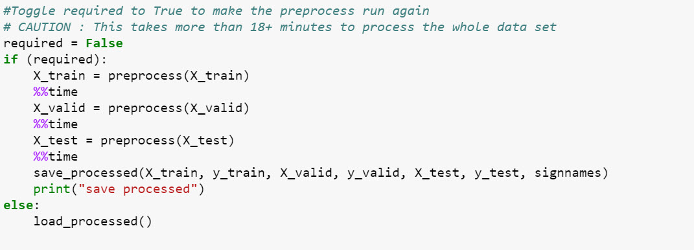

# **Traffic Sign Recognition** 

## Overview

In this project, I used the deep neural network specifically convnet i.e Convolutional Neural Networks to train the given German traffic sign [dataset-link to download](https://s3-us-west-1.amazonaws.com/udacity-selfdrivingcar/traffic-signs-data.zip). Once the model is trained evaluated using the test sets, then we download few sample traffic signs from internet and check the accuracy prediction of our model.

---

**Build a Traffic Sign Recognition Project**

The goals / steps of this project are the following:
* Load the data set (see below for links to the project data set)
* Explore, summarize and visualize the data set using LeNet Architecture.
* Design, train and test a model architecture
* Use the model to make predictions on new images
* Analyze the softmax probabilities of the new images
* Summarize the results with a written report

### Environment ####

* Host environment
* Ubuntu 16.04
* Anaconda 4.4.10
* Python 3.6.4
* TensorFlow 1.7.0 (GPU support)
* GPU : NVIDIA GeForce GTX 1070

#### Data Set ####
We already have three .p files of 32x32 resized images, which can be downloaded from here : [dataset download here](https://s3-us-west-1.amazonaws.com/udacity-selfdrivingcar/traffic-signs-data.zip)

* train.p: The training set.
* test.p: The testing set.
* valid.p: The validation set.
* signnames.csv: mapping of labels to training set.

We will use Python pickle to load the data.

The pickled data is a dictionary with 4 key/value pairs:

* 'features' is a 4D array containing raw pixel data of the traffic sign images, (num examples, width, height, channels).
* 'labels' is a 1D array containing the label/class id of the traffic sign. The file signnames.csv contains id -> name mappings for each id.
* 'sizes' is a list containing tuples, (width, height) representing the original width and height the image.
* 'coords' is a list containing tuples, (x1, y1, x2, y2) representing coordinates of a bounding box around the sign in the image.

 Number of training examples = 34799
 Number of validation examples = 4410
 Nuber of testing examples =  12630
 No of Examples= 34799 height x width= 32 X 32 channels= 3
 Number of classes from = 43
 
 Lets look at the Training Data Set
 
 
### Preprocessing the Data ###

---

### Step 3. Pre-Process the Data Set ###

In this section we can do many things such as normalizing the input so that the data has mean zero and equal variance. For image data we can normalize easily using (pixel - 128)/128.

There are other processing steps which can be optional. As we progress following are the options that we can explore.

1. Grayscaling
2. Data Normalization or Standardization
3. Exploring various contract and brightness aspects
4. Image enhancements, applying various filters
5. Shuffling our dataset
6. Data Augmentation
7. CLAHE Contrast Limited Adaptive Histogram Equalization [link here](https://docs.opencv.org/3.1.0/d5/daf/tutorial_py_histogram_equalization.html) 
7. Applying perception algorithms to normalize the image data 

#### Image Normalization ####
Normalization, feature scaling, or standardization is the last step in preprocessing our dataset, An implementation of MINMAX which applies (pixel - 128)/ 128 to every pixel of the image Mean normalization applying (pixel - images_mean) / images_std to every pixel of the image.

#### CALHE Histogram Equalization ###
The histogram equalization which we have used considers the global contrast of the image. In many cases, it is not a good idea. For example, in some of the images(see below) shows an input image and its result after global histogram equalization. The adaptive histogram equalization is used. In this, image is divided into small blocks called "tiles" (tileSize is 8x8 by default in OpenCV). Then each of these blocks are histogram equalized as usual. So in a small area, histogram would confine to a small region (unless there is noise). If noise is there, it will be amplified. To avoid this, contrast limiting is applied. If any histogram bin is above the specified contrast limit (by default 40 in OpenCV), those pixels are clipped and distributed uniformly to other bins before applying histogram equalization. After equalization, to remove artifacts in tile borders, bilinear interpolation is applied.

As mentioned in the FAQ video other pre-processing steps are optional. We can try different steps to see if it improves performance.

Processed Images can be seen here 

#### Saving and Loading Pre-processed Images ####

Processing of images in the train, validate and test data sets takes long amount of time, so what we do is we save the image in a processed Image pickle file as numpy array and get it back whenever we need.

### Design and Test a Model Architecture

The LeNet model is proposed by Yann LeCun in 1998, it is the most classific cnn model for image recognition, its architecture is as following: LENET proposal yann.lecun Gradient-Based Learning algorithms can be used to synthesize a complex decision surface that can classify high-dimensional patterns such as handwritten characters with minimal preprocessing.

#### Inception Model ####
The main idea of the Inception architecture is to consider how an optimal local sparse structure of a convolutional vision
network can be approximated and covered by readily available dense components. As these “Inception modules” are stacked on top of each other, their output correlation statistics are bound to vary: as features of higher abstraction are captured by higher layers, their spatial concentration is expected to decrease. This suggests that the ratio of 3×3 and 5×5 convolutions should increase as we move to higher layers.

All the convolutions, including those inside the Inception modules, use rectified linear activation. The size of the receptive field in our network is 32x32 in the RGB color space with zero mean. “#3×3 reduce” and “#5×5 reduce” stands for the number of 1×1 filters in the reduction layer used before the 3×3 and 5×5 convolutions. One can see the number of 1×1 filters in the projection layer after the built-in max-pooling in the pool proj column. All these reduction/projection layers use rectified linear activation as well.

| Type          | Kernel/Stride	| Output    | Parameters  |
|:-------------:|:-------------:|:---------:|:-----------:|
| conv          | 3x3/2x2       | 16x16x64  | 1,792       |
| inception(2a) |               | 16x16x256 | 137,072     |
| inception(2b)	|               | 16x16x480 | 388,736     |
| max pool    	| 3x3/2x2      	| 7x7x480   |             |
| inception(3a) |  	            | 7x7x512   | 433,792     |
| inception(3a) |  	            | 7x7x512   | 449,160     |
| max pool 	    | 3x3/2x2  	    | 3x3x512   |             |
| inception(4a) |  	            | 3x3x832   | 859,136     |
| inception(4a) |  	            | 3x3x1024  | 1,444,080   |
| avg pool 	    | 3x3/1x1  	    | 1x1x1024  |             |
| flatten	    | 864			| 1024      |             |
| full		    | 43            | 43        | 44,032      |

#### 4. Describe the approach taken for finding a solution and getting the validation set accuracy to be at least 0.93. Include in the discussion the results on the training, validation and test sets and where in the code these were calculated. Your approach may have been an iterative process, in which case, outline the steps you took to get to the final solution and why you chose those steps. Perhaps your solution involved an already well known implementation or architecture. In this case, discuss why you think the architecture is suitable for the current problem.

My final model results were:
* training set accuracy of 100%
* validation set accuracy of 98.6%
* test set accuracy of 97.6%

If an iterative approach was chosen:
* What was the first architecture that was tried and why was it chosen?

The CNN architecture was inspired by [GoogLeNet] (https://www.cs.unc.edu/~wliu/papers/GoogLeNet.pdf). Color image with 32x32 px resolution is used as input, 43 neourns in the output layer represent the all signs present the signames.csv file. The CNN consists of two inception modules which are the same to ones from the GoogLeNet, but with two dimension reduction / dimension increase convolution 1x1 layers before and after 3x3 and 5x5 convolutions inception modules are alternating with maxpooling layers and are followed by a fc layer with 1024 output neurons. The layer uses 50% dropout and experiments shown that it really help to decrease overfitting.

The architecture is combination of CNN and GoogLeNet and created with lot of trial and error to decrease the overfitting by using 50% dropouts and underfitting by just selecting enough EPOCHS.

* What were some problems with the initial architecture?

There were several problems starting from the EPOCHs if increased would take enoromous CPU time, Increasing the Inception Model between 1x1, 3x3, and 5x5 needs to be balanced to achieve proper distribution. Since the images were not distributed evenly (may be I can use shuffle) there was poor training accuracy results early on.

* How was the architecture adjusted and why was it adjusted? Typical adjustments could include choosing a different model architecture, adding or taking away layers (pooling, dropout, convolution, etc), using an activation function or changing the activation function. One common justification for adjusting an architecture would be due to overfitting or underfitting. A high accuracy on the training set but low accuracy on the validation set indicates over fitting; a low accuracy on both sets indicates under fitting.

It was a trial and error process, but most of the steps were either inspired by the GoogleLeNet paper or some of them after discussing or even looking at the different hyper parameters from the github.

Since it was image classification problem, convnet layers were used with inception models to reduce the computation.It seems to me that inception moduls are essential for good performance on such kind of tasks as they allow to do not select optimal layer (say, convolution 5x5 or 3x3), by performing on multiple layers it selects the optimal inception Model on its own.

Even the drop out was not considered early on but after toiling through some of the code I introduced dropout which avoided the overfitting of the data, increased accuracy on the testing set in the end.

* Which parameters were tuned? How were they adjusted and why?

There were several parameter were toggled strides in the Convulation layers, Sized of the convultion layers inside the Inception Model, 1x1, 3x3 and 5x5.  

dropout rate toggled between 30-60, 43 seems to be optimal.

Hyper Parameters

* EPOCHS = 35
* LEARNING RATe = 4e-4 
* BATCH_SIZE = 128 

Drop out 
*keep_prob = 0.5 to 1.0 (varies from training/validation to testing).

* What are some of the important design choices and why were they chosen? For example, why might a convolution layer work well with this problem? How might a dropout layer help with creating a successful model?

There were several design chocies during the run, right from selecting the optimal LeNet architecture in this case I referred to the [GoogLeNet] (https://www.cs.unc.edu/~wliu/papers/GoogLeNet.pdf), which prescribed coming out with Inception Model which included 1x1, 3x3 and 5x5 convnet models. 

In terms of performance CNN will outperform traditional Neural Networks, another main feature of CNNs is weight sharing. Lets take an example to explain this. Say you have a one layered CNN with 10 filters of size 5x5. Now you can simply calculate parameters of such a CNN, it would be 5*5*10 weights and 10 biases i.e 5* 5*10 + 10 = 260 parameters.

Dropout will enventually help in overfitting the data, but finding the optimal dropout percentage would be little tricky.

* What architecture was chosen?

Architecture chosen here is simmilar to the Googlenet Architecture, With smaller changes to whole architecture.

An average pooling layer with 5×5 filter size and stride 1, resulting in an 3×3×1024 output for the (4a),

• A 1×1 convolution with 128 filters for dimension reduction and rectified linear activation.
• A fully connected layer with 1024 units and rectified linear activation.
• A dropout layer with 50% ratio of dropped outputs.

* Why did you believe it would be relevant to the traffic sign application?

Since the Traffic Sign Application requires elaborate image processing coupled with machine learning, regular neural network would not do the job or would require more time to do the same amount of processing so I guess in this case implementation of convnet is more apt.

* How does the final model's accuracy on the training, validation and test set provide evidence that the model is working well?
 
    * training set accuracy of 100%
    * validation set accuracy of 98.6%
    * test set accuracy of 97.6%
 
 This is the indication that model is working well.
 
### Test a Model on New Images

#### 1. Choose five German traffic signs found on the web and provide them in the report. For each image, discuss what quality or qualities might be difficult to classify.

Here are five German traffic signs that I found on the web:

#### 2. Discuss the model's predictions on these new traffic signs and compare the results to predicting on the test set. At a minimum, discuss what the predictions were, the accuracy on these new predictions, and compare the accuracy to the accuracy on the test set (OPTIONAL: Discuss the results in more detail as described in the "Stand Out Suggestions" part of the rubric).

Here are the results of the prediction:

| Image			        |     Prediction	        					                        | 
|:---------------------:|:---------------------------------------------:| 
|Speed Limit    		| Speed Limit 								                               	| 
| Stop      		   	| Stop  	  								                                  	|
| Pedestrian		   	| s { color: green }Road Narrows on Right s { font-style: normal; } |
| No Entry	      	| No Entry  					 				                                |
| Yield     			   | Yield      							                                  |

The model was able to correctly guess 4 of the 5 traffic signs, which gives an accuracy of 80%. 

#### 3. Describe how certain the model is when predicting on each of the five new images by looking at the softmax probabilities for each prediction. Provide the top 5 softmax probabilities for each image along with the sign type of each probability. (OPTIONAL: as described in the "Stand Out Suggestions" part of the rubric, visualizations can also be provided such as bar charts)

The code for making predictions on my final model is located in the 90th cell of the Ipython notebook.

